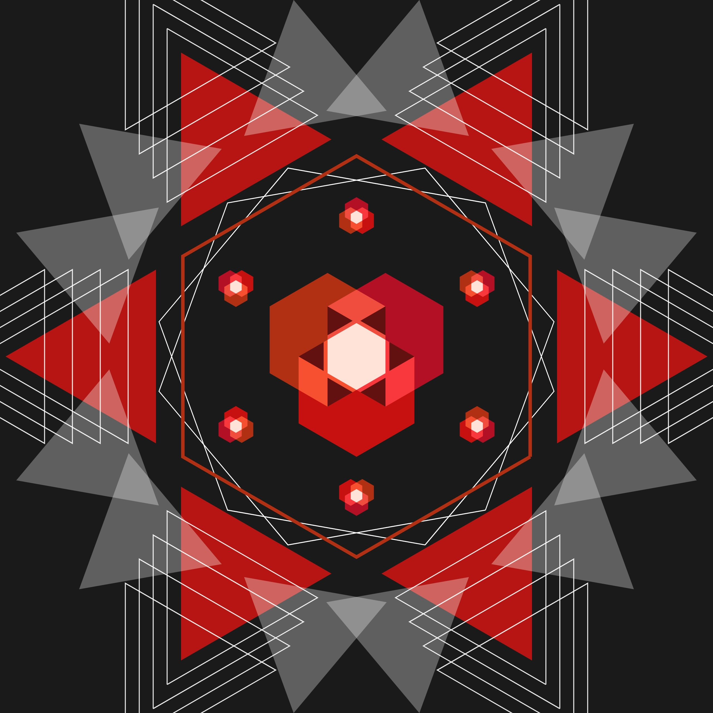
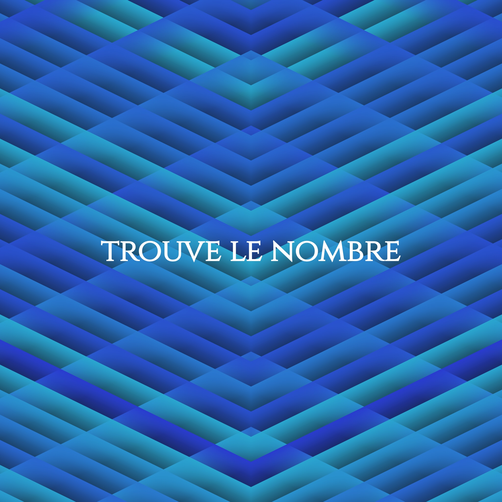

ENSAAMA 2023-2024
# Pratiques (Artistiques) Web & Digitales

[(evaluation - semestre 1)](https://jniac.github.io/ensaama-2324-pwd/info/info/)

[Projet Unreal (ENSAAMA_PWD_2324_UE5)](https://github.com/jniac/ENSAAMA_PWD_2324_UE5)

Demo:
- [split page](https://jniac.github.io/ensaama-2324-pwd/art/jniac/exercices/split/)
- [eclosion 10/01/24](https://jniac.github.io/ensaama-2324-pwd/art/jniac/eclosion/v01-10-a/)

## Portes Ouvertes
- [instructions pour affichage sur poste de travail en local](md/PO-INSTRUCTIONS.md)
- [po-digital-design](https://jniac.github.io/ensaama-2324-pwd/common-projects/po-digital-design/)
- [po-eclosion](https://jniac.github.io/ensaama-2324-pwd/common-projects/po-eclosion/)

## eclosion project
- [eclosion project](https://jniac.github.io/ensaama-2324-pwd/common-projects/eclosion/)

## Find the number

## colorful project
- [colorful project](https://jniac.github.io/ensaama-2324-pwd/common-projects/colorful/)

### Travaux

[Miranda (mirandaMllrd)](https://jniac.github.io/ensaama-2324-pwd/art/mirandaMllrd/colorful/)

[Safia (SafiaHRCH)](https://jniac.github.io/ensaama-2324-pwd/art/SafiaHRCH/colorful/)

---

[Lou (Dissolvons)](https://jniac.github.io/ensaama-2324-pwd/art/Dissolvons/colorful/)

[Martin (martindabo)](https://jniac.github.io/ensaama-2324-pwd/art/martindabo/colorful/)

[Louise (ldssrt)](https://jniac.github.io/ensaama-2324-pwd/art/ldssrt/colorful/)

[Celia (babib3l)](https://jniac.github.io/ensaama-2324-pwd/art/babib3l/colorful/)

## Notes

Les ressources suivantes sont de bonne qualité :
- [easings.js](common-resources/js/easings.js) permet de définir des courbes transitions (ease in/out, cubic-bezier...).
- [prng.js](common-resources/js/prng.js) permet de générer des nombres aléatoires de manière prédictive en utilisant les opérations sur les BigInt.
