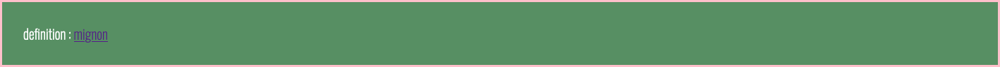

# NOTES
(preview markdown dans vs : ctrl + shift + p)

## css
Un noeud de la page est dessiné en fonction de 3 principales propriétés
- margin ( marges)
- border ( bordures)
- paddinng (interieures)

exemple de css :
```css
div{
    margin; 16px; /*16 pixels en haut, bas,gauche,droite*/

    border-top: 32px; /* override: 32 pixels pour le haut UNIQUEMENT*/ 
    border: solid 8px purple;
    padding: 24px;
}
```

