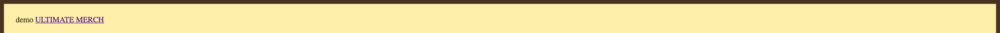

# Notes

(preview markdown dans VSCode : cmd + shift + P)

## CSS

Un noeud de la page est dessiné en fonction de trois principales propriétés
- margin (les marges extérieures)
- border (la bordure)
- padding (les marges intérieures)

Exemple de css :
```css
div {
    margin: 16px; /* 16 pixels en haut, bas; gauche et droite */
    margin-top: 32px; /* overide: 32 pixels pour le haut UNIQUEMENT */
    border: solid 8px purple;
    padding: 24px; 
}
```
