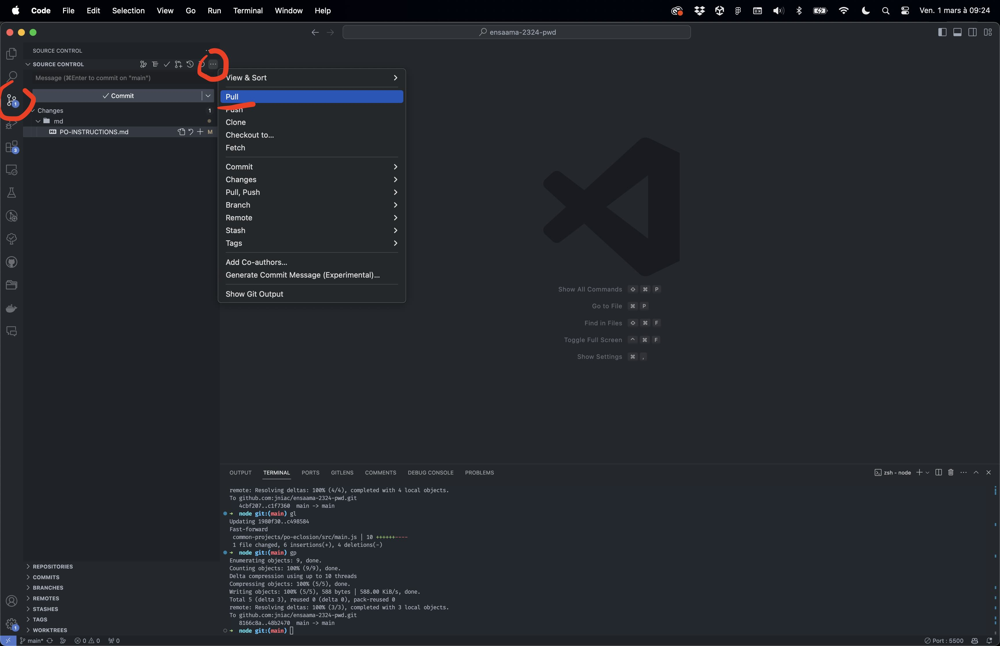
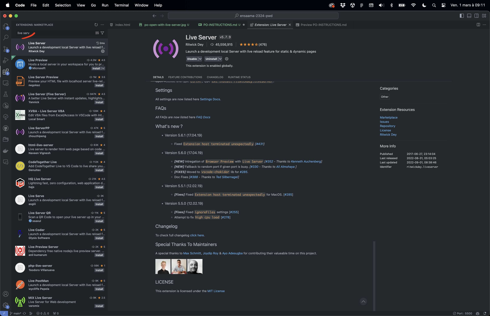
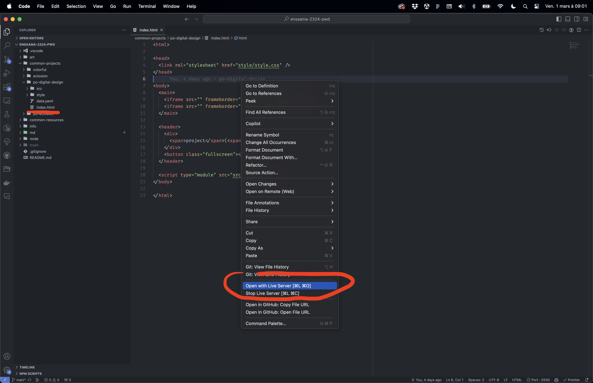
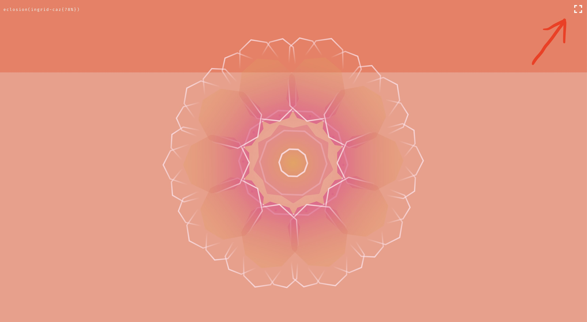

# PO Instructions

Instructions pour affichage sur poste de travail en "local".

> NOTE :  
> Pour une version "online" les liens suivants suffisent pour accéder aux expériences: 
> - [po-digital-design](https://jniac.github.io/ensaama-2324-pwd/common-projects/po-digital-design/)
> - [po-eclosion](https://jniac.github.io/ensaama-2324-pwd/common-projects/po-eclosion/)

Pour lancer les expériences "PO" en "local", il faut : 

- Cloner le dépôt git (ensaama-2324-pwd) quelque part sur la machine (généralement le dossier "Documents")

- Ouvrir le dépôt / dossier ensaama-2324-pwd avec VSCode

- S'assurer que le dépot est à jour (git pull)
    

- S'assurer que l'extension [live server](https://github.com/ritwickdey/vscode-live-server) a été installée dans VSCode
    

- Dans VSCode, ouvrir au choix l'une deux pages suivantes :
  - [/common-projects/po-digital-design/index.html](../common-projects/po-digital-design/index.html)
  - [/common-projects/po-eclosion/index.html](../common-projects/po-eclosion/index.html)

- Puis, par un clic droit, ouvrir la page avec live server.
    

- La page s'ouvre automatiquement dans le navigateur par défaut. Si ce n'est pas Chrome, ouvrir la page dans Chrome (support CSS, performances).

- Mettre la page en plein écran !
    
